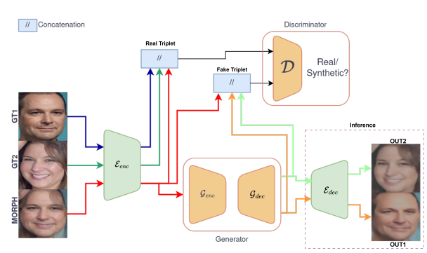
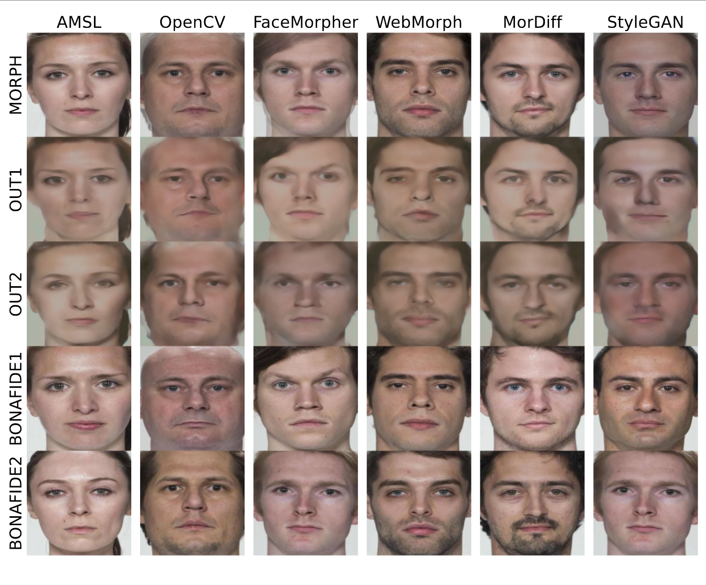

# Facial Demorphing from a Single Morph Using a Latent Conditional GAN

**Authors:** Nitish Shukla, Arun Ross  
**Venue:** IEEE International Joint Conference on Biometrics (IJCB 2025) 


## Abstract

A morph is created by combining two (or more) face images from two (or more) identities to create a composite image that is highly similar to all constituent identities, allowing the forged morph to be biometrically associated with more than one individual. Morph Attack Detection (MAD) can be used to detect a morph, but does not reveal the constituent images. Demorphing - the process of deducing the constituent images - is thus vital to provide additional evidence about a morph. Existing demorphing methods suffer from the morph replication problem, where the outputs tend to look very similar to the morph itself, or assume that train and test morphs are generated using the same morph technique. The proposed method overcomes these issues. The method decomposes a morph in latent space allowing it to demorph images created from unseen morph techniques and face styles. We train our method on morphs created from synthetic faces and test on morphs created from real faces using different morph techniques. Our method outperforms existing methods by a considerable margin and produces high fidelity demorphed face images. ([arxiv.org](https://arxiv.org/html/2507.18566v1?utm_source=chatgpt.com))

## Methodology


*Figure 1: Proposed Demorphing Architecture: An encoder, compresses the morph along with the constituent face images during training. The generator, G, reconstructs two face images conditioned on the morph in the encoder's latent domain. The discriminator distinguishes between real and synthesized face feature triplets. During inference, a decompressor, recovers the constituent images. Note that the decoder, is used only during inference to decompress the demorphed outputs.*

### Contribution
- **Identity Preservation**: The method maintains high identity preservation, as measured by restoration accuracy.
- **Visual Fidelity**: Generated images closely resemble the original constituent faces.
- **Generalization**: The model effectively handles morphs generated using various techniques and face styles.


## Results

The proposed method was evaluated on several benchmark morph datasets, demonstrating superior performance in demorphing accuracy compared to existing techniques. Quantitative results show significant improvements in terms of both visual fidelity and identity preservation.


*Figure 2: Demorphing outcomes across six different morphing techniques.*


## Citation

```
@article{shukla2025facial,
  title={Facial Demorphing from a Single Morph Using a Latent Conditional GAN},
  author={Shukla, Nitish and Ross, Arun},
  journal={arXiv preprint arXiv:2507.18566},
  year={2025}
}
```

## License

This work is licensed under a [CC BY 4.0](https://creativecommons.org/licenses/by/4.0/) license.

---

For more details, please refer to the full paper: [arXiv:2507.18566](https://arxiv.org/pdf/2507.18566).

